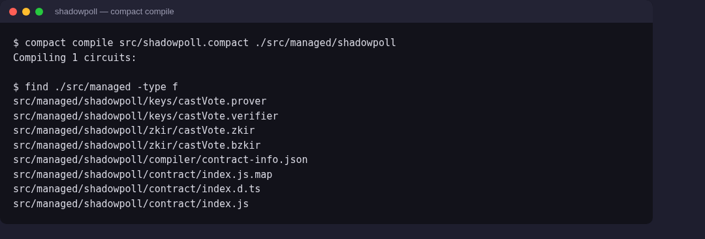
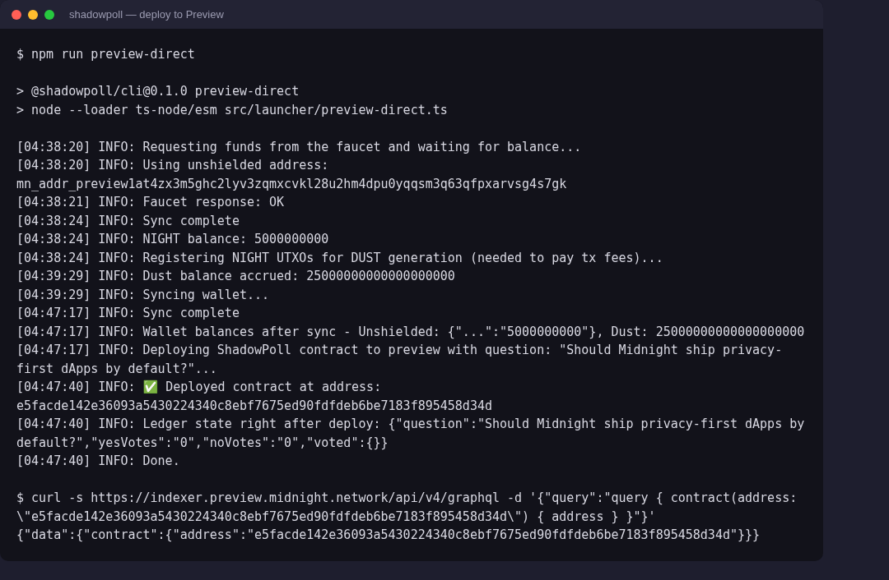

# ShadowPoll

A private voting/polling contract for [Midnight](https://midnight.network), built for the **Moonlight Challenges — Level 1: New Moon**.

## Product idea

ShadowPoll is a minimal private polling primitive for Midnight: anyone can open a yes/no poll, and anyone can cast a vote that gets folded into a public running tally — without ever revealing *who* voted or *how they voted*. Today's DAO and community polling tools force a trade-off between transparency (public tallies, but every vote is doxxed and open to social pressure or vote-buying) and privacy (secret ballots, but no way to verify the count wasn't tampered with). ShadowPoll resolves that by keeping the ballot private as a Compact witness while the tally itself lives in public ledger state, so anyone can audit the result on-chain while no one — not even the contract — ever learns an individual's choice. The long-term idea is to grow this into a lightweight polling widget that DAOs, communities, and workplaces can embed to run quick, tamper-evident, coercion-resistant votes.

## Public state vs. private witness

This is the core privacy pattern the contract demonstrates:

| | Public ledger state | Private witness |
|---|---|---|
| **What** | `question`, `yesVotes`, `noVotes`, `voted` (a set of nullifiers) | `mySecretId` (a persistent per-voter secret), `myChoice` (this vote's yes/no) |
| **Who can see it** | Anyone reading the chain / indexer | Only the voter's own wallet — resolved locally, never transmitted |
| **Why** | The whole point of a poll is a publicly verifiable result | The whole point of privacy is that no one can link a person to a vote |

Concretely, in [`contract/src/shadowpoll.compact`](contract/src/shadowpoll.compact):

- `castVote()` derives a **nullifier** — `persistentHash(secretId)` — from the voter's private `mySecretId` witness and `disclose()`s *only that hash* to the public `voted` set. This proves "this identity hasn't voted yet" without ever revealing the identity itself, since the hash can't be reversed back to the secret.
- The voter's `myChoice` witness (yes/no) is `disclose()`d at the point it's used to decide which counter (`yesVotes` or `noVotes`) to increment. That disclosure is deliberate and unavoidable — the aggregate tally *is* the public output of a poll — but because it's never combined with the nullifier or any other identifying data in the same disclosure, the running totals are the only thing anyone can observe. Nothing on-chain ties a specific increment back to a specific voter.
- Two different people voting the same way produce two different nullifiers (since each has a different `secretId`), so even repeated identical votes never collide or leak linkage.

This mirrors the general Compact pattern: keep everything in `witness` functions by default, and reach for `disclose()` only at the exact point where a value is deliberately meant to become public — never by accident.

## Repo layout

```
contract/   Compact contract, compiled circuits (managed/), and unit tests (vitest)
api/        Thin TypeScript API wrapping the compiled contract (deploy/join/castVote)
cli/        Deployment scripts for Preview/Preprod using a local proof server
```

## Prerequisites

- [Node.js 22+](https://nodejs.org) (see `.nvmrc`)
- [Docker](https://www.docker.com/) (for the local proof server)
- The [Compact compiler](https://docs.midnight.network/develop/tutorial/building/) (`compact` CLI), installed via:
  ```bash
  curl --proto '=https' --tlsv1.2 -LsSf https://github.com/midnightntwrk/compact/releases/latest/download/compact-installer.sh | sh
  compact update
  ```

## Setup — run locally

```bash
# 1. Install dependencies (installs the contract, api, and cli workspaces)
npm install

# 2. Compile the Compact contract into circuits + keys (managed/)
npm run compact --workspace=contract

# 3. Run the contract's test suite
npm run test --workspace=contract

# 4. Build the TypeScript packages
npm run build --workspace=contract
npm run build --workspace=api
```

### Compile output

`npm run compact --workspace=contract` runs `compact compile src/shadowpoll.compact ./src/managed/shadowpoll` and generates:

```
contract/src/managed/shadowpoll/
├── compiler/contract-info.json
├── contract/index.{js,d.ts}     # generated TS bindings (Ledger type, Contract class, pureCircuits)
├── keys/castVote.{prover,verifier}
└── zkir/castVote.{zkir,bzkir}
```



## Deploying to Preview / Preprod

Deployment uses a local proof server (rather than the ephemeral docker-managed one) for reliability:

```bash
# 1. Start a local proof server
cd cli
docker compose -f proof-server-local.yml up -d

# 2. Deploy (generates a fresh wallet, requests test tokens from the network
#    faucet, registers DUST for fees, then deploys the contract)
npm run preview-direct   # or: npm run preprod-direct
```

Each run logs progress to `logs/<network>-direct/<timestamp>.log`, culminating in the deployed contract address.



**Deployed contract (Preview):** [`e5facde142e36093a5430224340c8ebf7675ed90fdfdeb6be7183f895458d34d`](https://indexer.preview.midnight.network/api/v4/graphql) — independently queryable via the Preview indexer's `contract(address: "...")` GraphQL query.

To re-use a specific wallet instead of generating a fresh one, set `WALLET_SEED` (or `WALLET_MNEMONIC`) in the environment before running the deploy script. Never use a seed that holds real funds — this script logs the seed and persists private state to disk.

> **Note on wallet sync:** `waitForUnshieldedFunds`/`syncWallet` wait for a *full* sync (shielded + unshielded + dust lanes), not just a non-zero balance. A wallet with a long prior transaction history can take several minutes to fully resync its DUST-lane merkle/witness state from a fresh local store; building a deploy transaction before that finishes produces a proof the chain rejects (`1010: Invalid Transaction: Custom error: 170` / `InvalidDustSpendProof`), even though the balance already looks ready.

## License

[MIT](LICENSE)
