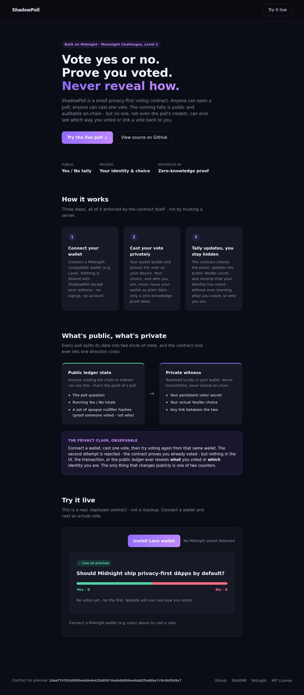
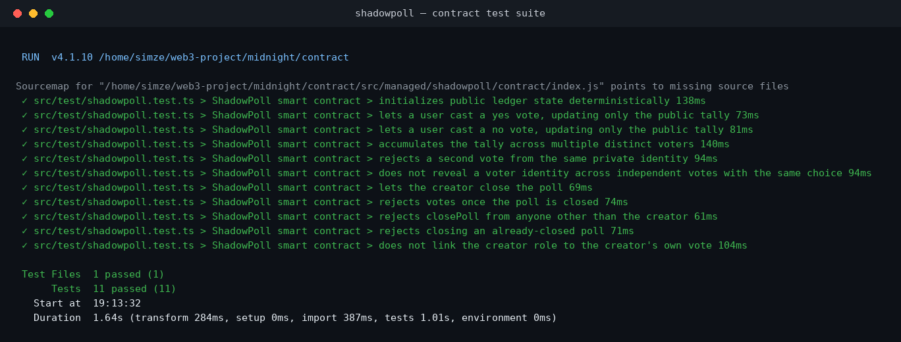

# ShadowPoll

[](https://github.com/Abidoyesimze/shadowpoll/actions/workflows/ci.yml)

A private voting/polling contract for [Midnight](https://midnight.network), built for the **Moonlight Challenges** — [Level 1: New Moon](#level-1--new-moon), [Level 2: First Crescent](#level-2--first-crescent), and [Level 3: Half Moon](#level-3--half-moon).

**Live demo:** [shadowpoll-frontend.vercel.app](https://shadowpoll-frontend.vercel.app)
**Contract (Preview):** [`2daaffd761b9695e4ddede415d83b7dade6b999ea0da825e60ba7c9c6b55d3a7`](https://indexer.preview.midnight.network/api/v4/graphql) — see [Level 2](#level-2--first-crescent) for why Preview, not Preprod
**Demo video (Level 2):** [Watch on Loom](https://www.loom.com/share/0acbb755c90d44e886c8d400ccb9c9e4)
**Demo video (Level 3):** [Watch on Loom](https://www.loom.com/share/aeaa6c73801546cca1d1fcdcf5a5779f)
**Chosen idea:** Private Voting — anonymous ballots with publicly verifiable tallies (see [Level 3](#level-3--half-moon))

## Product idea

ShadowPoll is a minimal private polling primitive for Midnight: anyone can open a yes/no poll, and anyone can cast a vote that gets folded into a public running tally — without ever revealing *who* voted or *how they voted*. Today's DAO and community polling tools force a trade-off between transparency (public tallies, but every vote is doxxed and open to social pressure or vote-buying) and privacy (secret ballots, but no way to verify the count wasn't tampered with). ShadowPoll resolves that by keeping the ballot private as a Compact witness while the tally itself lives in public ledger state, so anyone can audit the result on-chain while no one — not even the contract — ever learns an individual's choice. The long-term idea is to grow this into a lightweight polling widget that DAOs, communities, and workplaces can embed to run quick, tamper-evident, coercion-resistant votes.

## Public state vs. private witness

This is the core privacy pattern the contract demonstrates:

| | Public ledger state | Private witness |
|---|---|---|
| **What** | `question`, `yesVotes`, `noVotes`, `voted` (a set of nullifiers), `creatorNullifier`, `closed` | `mySecretId` (a persistent per-identity secret), `myChoice` (this vote's yes/no) |
| **Who can see it** | Anyone reading the chain / indexer | Only that identity's own wallet — resolved locally, never transmitted |
| **Why** | The whole point of a poll is a publicly verifiable result | The whole point of privacy is that no one can link a person to a vote, or to the fact that they created the poll |

Concretely, in [`contract/src/shadowpoll.compact`](contract/src/shadowpoll.compact):

- `castVote()` derives a **nullifier** — `persistentHash(secretId)` — from the voter's private `mySecretId` witness and `disclose()`s *only that hash* to the public `voted` set. This proves "this identity hasn't voted yet" without ever revealing the identity itself, since the hash can't be reversed back to the secret.
- The voter's `myChoice` witness (yes/no) is `disclose()`d at the point it's used to decide which counter (`yesVotes` or `noVotes`) to increment. That disclosure is deliberate and unavoidable — the aggregate tally *is* the public output of a poll — but because it's never combined with the nullifier or any other identifying data in the same disclosure, the running totals are the only thing anyone can observe. Nothing on-chain ties a specific increment back to a specific voter.
- Two different people voting the same way produce two different nullifiers (since each has a different `secretId`), so even repeated identical votes never collide or leak linkage.
- **`closePoll()` applies the identical technique to a second, separate role.** The poll's creator commits a `creatorNullifier` at deploy time (the same `mySecretId`, hashed in its own domain via `creatorNullifierFor` so it can never collide with - or be linked to - that same identity's voter nullifier). Closing the poll means re-deriving that nullifier and proving it matches, without ever disclosing *who* the creator is. A creator who also votes leaves two unlinkable public traces, not one.

This mirrors the general Compact pattern: keep everything in `witness` functions by default, and reach for `disclose()` only at the exact point where a value is deliberately meant to become public — never by accident.

### The privacy claim, observable

Level 2 asks for "something proven without being shown." Here it is: **connect a wallet, cast one vote, then try to vote again from that same wallet.** The second attempt is rejected — the contract proves you already voted — but at no point does the UI, the transaction, or the public ledger state ever reveal *what* you voted or *which* on-chain identity you are. The only thing that changes publicly is one of two aggregate counters. Anyone watching the indexer sees a tally move and a nullifier hash appear in a set; no one, including whoever's running the poll, can work backwards from that to a person or a choice. See [`docs/demo-script.md`](docs/demo-script.md) for the exact walkthrough.

## Repo layout

```
contract/   Compact contract, compiled circuits (managed/), and unit tests (vitest)
api/        Thin TypeScript API wrapping the compiled contract (deploy/join/castVote)
cli/        Deployment scripts for Preview/Preprod using a local proof server
frontend/   React/Vite web UI: live poll display + Lace-connected voting
```

## Prerequisites

- [Node.js 22+](https://nodejs.org) (see `.nvmrc`)
- [Docker](https://www.docker.com/) (for the local proof server, only needed for CLI deploys)
- The [Compact compiler](https://docs.midnight.network/develop/tutorial/building/) (`compact` CLI), installed via:
  ```bash
  curl --proto '=https' --tlsv1.2 -LsSf https://github.com/midnightntwrk/compact/releases/latest/download/compact-installer.sh | sh
  compact update
  ```

## Setup — run locally

```bash
# 1. Install dependencies (installs every workspace: contract, api, cli, frontend)
npm install

# 2. Compile the Compact contract into circuits + keys (managed/)
npm run compact --workspace=contract

# 3. Run the contract's test suite
npm run test --workspace=contract

# 4. Build the TypeScript packages
npm run build --workspace=contract
npm run build --workspace=api
```

---

## Level 1 — New Moon

Toolchain set up, first Compact contract written and deployed to Preview.

### Compile output

`npm run compact --workspace=contract` runs `compact compile src/shadowpoll.compact ./src/managed/shadowpoll` and generates:

```
contract/src/managed/shadowpoll/
├── compiler/contract-info.json
├── contract/index.{js,d.ts}     # generated TS bindings (Ledger type, Contract class, pureCircuits)
├── keys/castVote.{prover,verifier}
└── zkir/castVote.{zkir,bzkir}
```


### Deploying to Preview / Preprod

Deployment uses a local proof server (rather than the ephemeral docker-managed one) for reliability:

```bash
# 1. Start a local proof server
cd cli
docker compose -f proof-server-local.yml up -d

# 2. Deploy (generates a fresh wallet, requests test tokens from the network
#    faucet, registers DUST for fees, then deploys the contract)
npm run preview-direct   # or: npm run preprod-direct
```

Each run logs progress to `logs/<network>-direct/<timestamp>.log`, culminating in the deployed contract address.


**Deployed contract (Preview), original Level 1 version:** [`e5facde142e36093a5430224340c8ebf7675ed90fdfdeb6be7183f895458d34d`](https://indexer.preview.midnight.network/api/v4/graphql) — independently queryable via the Preview indexer's `contract(address: "...")` GraphQL query. Superseded for Level 3 by a redeploy with `closePoll` added - see [Level 3](#level-3--half-moon) for the current live contract address.

To re-use a specific wallet instead of generating a fresh one, set `WALLET_SEED` (or `WALLET_MNEMONIC`) in the environment before running the deploy script. Never use a seed that holds real funds — this script logs the seed and persists private state to disk.

> **Note on wallet sync:** `waitForUnshieldedFunds`/`syncWallet` wait for a *full* sync (shielded + unshielded + dust lanes), not just a non-zero balance. A wallet with a long prior transaction history can take several minutes to fully resync its DUST-lane merkle/witness state from a fresh local store; building a deploy transaction before that finishes produces a proof the chain rejects (`1010: Invalid Transaction: Custom error: 170` / `InvalidDustSpendProof`), even though the balance already looks ready. A wallet address with *no* prior history on a given network needs a genuinely long first-time sync (many minutes, multiple GB of memory) - see `cli/src/wallet-utils.ts` for how that's made resilient to transient stalls.

---

## Level 2 — First Crescent

Contract wired to a frontend UI, with Lace connected.

### Running the frontend

```bash
# 1. Compile the contract first if you haven't (frontend serves its circuit
#    artifacts as static files, copied from contract/src/managed)
npm run compact --workspace=contract

# 2. Run the frontend
npm run dev --workspace=frontend
```



Live at **[shadowpoll-frontend.vercel.app](https://shadowpoll-frontend.vercel.app)**. The landing page (`/`) is marketing copy; the actual product lives on separate routes:

- **`/app` or `/app/:contractAddress`** — live poll display (`frontend/src/hooks/usePollState.ts`, reads the indexer directly, no wallet needed) plus Lace-connected voting. `frontend/src/lib/wallet-bridge.ts` bridges the injected [dapp-connector](https://www.npmjs.com/package/@midnight-ntwrk/dapp-connector-api) API (e.g. [Lace](https://www.lace.io/)) to the `WalletProvider`/`MidnightProvider` interfaces `@shadowpoll/api`'s `ShadowPollAPI.castVote()` expects - connect, get funds-aware state, call the `castVote` circuit, submit through the wallet, disconnect. Proving is delegated to the wallet itself by default (`getProvingProvider`, see `frontend/src/lib/providers.ts`), not a locally-run proof server, so this works for any visitor with a compatible wallet installed and no Docker setup. Set `VITE_USE_LOCAL_PROOF_SERVER=true` to instead prove against a proof server you run yourself.
- **`/create`** — deploy a brand new poll from the browser (`frontend/src/pages/CreatePoll.tsx`), calling `ShadowPollAPI.deploy()` with the connected wallet, then redirecting to `/app/:contractAddress` for the poll just created. The creating wallet's identity becomes that poll's creator - the only one who'll ever see the `closePoll` control on it, without that role being visible to anyone else (see [Public state vs. private witness](#public-state-vs-private-witness)).

### Deploying the frontend

This is an npm-workspaces monorepo, and `frontend/` depends on the sibling `contract/` and `api/` workspaces being built first - Vercel's (or Netlify's) framework auto-detection doesn't know that, and will also misread the top-level `api/` folder as serverless functions if left on defaults. Configure these explicitly rather than relying on auto-detect:

| Setting | Value |
|---|---|
| Root Directory | `frontend` |
| Framework Preset | Vite |
| Install Command | `echo skip-default-install` (a no-op - the build command below does its own install) |
| Build Command | `cd .. && npm install && npm run build --workspace=contract && npm run build --workspace=api && cd frontend && npm run build` |
| Output Directory | `dist` |

No environment variables are required - `frontend/src/lib/env.ts`'s defaults already point at the deployed contract below. See that file if you want to override the network or contract address instead.

### Why Preview, not Preprod

Level 2 asks for Preprod specifically, and the frontend/CLI both support it (`VITE_NETWORK=preprod`, `npm run preprod-direct`) - but as of this writing, Preprod's faucet won't fund a deploying wallet, which blocks a fresh deploy there. This isn't a sync-time or memory issue (both of which came up and were fixed along the way, see `cli/src/wallet-utils.ts`) - it's that the SDK's faucet client (`@midnight-ntwrk/testkit-js`'s `FaucetClient`) posts to the wrong endpoint with an outdated request shape. The real Preprod faucet frontend calls `POST https://midnight-tmnight-preprod.nethermind.dev/api/request-tokens` with a `{address, captchaToken}` body gated by Cloudflare Turnstile; the SDK instead posts `{recipientAddress, amount}` straight to the faucet's root URL, which Express's SPA fallback answers with a misleading `200 OK` HTML page - so the deploy script logs "Faucet response: OK" and then waits forever, since no tokens were ever actually requested. Confirmed by replaying the real request manually:

```
$ curl -X POST https://midnight-tmnight-preprod.nethermind.dev/api/request-tokens \
    -H "Content-Type: application/json" \
    -d '{"address":"mn_addr_preprod1...","captchaToken":"x"}'
{"status":"error","message":"Captcha verification failed: invalid-input-response"}
```

A real captcha token only comes from a human completing the challenge in a browser, so this contract is deployed to **Preview** instead - originally the same address from [Level 1](#deploying-to-preview--preprod), later redeployed for Level 3 with `closePoll` added (see [Level 3](#level-3--half-moon)) - with the frontend's Lace integration, circuit call, and privacy behavior otherwise identical to what Level 2 asks for on Preprod. Swapping networks once the faucet is fixed is a one-line env var change.

### Privacy claim

See [The privacy claim, observable](#the-privacy-claim-observable) above, and [`docs/demo-script.md`](docs/demo-script.md) for the exact steps the demo video walks through: connect → cast a vote (circuit call) → attempt a second vote from the same wallet (rejected, without revealing why to any observer) → disconnect.

### Demo video

**[Watch on Loom](https://www.loom.com/share/0acbb755c90d44e886c8d400ccb9c9e4)** - recorded by following [`docs/demo-script.md`](docs/demo-script.md) against the live deploy above: connect Lace, cast a vote (the `castVote` circuit call), and the observable privacy behavior.

## Level 3 — Half Moon

A polished, production-grade dApp: tests, CI/CD, and a chosen problem from the Moonlight Challenges idea list.

### Chosen idea: Private Voting

ShadowPoll already *is* "Private Voting — anonymous ballots with publicly verifiable tallies," the first idea on the provided list - Levels 1 and 2 built exactly this, so Level 3 is about hardening it (tests, CI, honest documentation of what's real vs. in-progress) rather than starting a new project. See [Product idea](#product-idea) above for the full pitch. The proposal itself is submitted separately via the challenge dashboard, not tracked in this repo.

### Deployed contract

Level 3 adds `closePoll` to the contract (see [Public state vs. private witness](#public-state-vs-private-witness) above), which changes the ledger's on-chain schema, so it needed a fresh deploy rather than reusing the Level 1/2 address:

**Deployed contract (Preview):** [`2daaffd761b9695e4ddede415d83b7dade6b999ea0da825e60ba7c9c6b55d3a7`](https://indexer.preview.midnight.network/api/v4/graphql) — independently queryable via the Preview indexer's `contract(address: "...")` GraphQL query. This is the address the live demo and frontend now point at.

### Tests

```bash
npm run test --workspace=contract
```

11 tests in [`contract/src/test/shadowpoll.test.ts`](contract/src/test/shadowpoll.test.ts), each checking a specific privacy or correctness property rather than just exercising code paths:

- initializes public ledger state deterministically
- casting a yes vote updates only the public tally
- casting a no vote updates only the public tally
- accumulates the tally correctly across multiple distinct voters
- rejects a second vote from the same private identity
- does not reveal a voter identity across independent votes with the same choice
- lets the creator close the poll
- rejects votes once the poll is closed
- rejects `closePoll` from anyone other than the creator
- rejects closing an already-closed poll
- does not link the creator role to the creator's own vote



### CI/CD

[`​.github/workflows/ci.yml`](.github/workflows/ci.yml) runs on every push/PR to `main`: installs the workspace, builds `contract` and `api`, runs the contract test suite, typechecks `cli` and `frontend`, and does a full production build of the frontend - so a broken build or a failing test is caught before merge, not discovered after deploy. Badge at the top of this README links to the latest run.

The Compact compiler itself isn't installed in the CI runner (it's a standalone toolchain, not an npm package) - the compiled circuit artifacts under `contract/src/managed/` are committed to git precisely so CI (and anyone cloning the repo) doesn't need it just to build and test the TypeScript layers. Recompiling from `.compact` source still requires the toolchain locally, per [Prerequisites](#prerequisites).

### Privacy model: what an observer can and cannot learn

Anyone with access to the Preview indexer or a block explorer - not just other players, literally anyone, with no special access - can query this contract. Here's exactly what that gets them:

**An observer *can* learn:**
- The poll's question text (public from deployment).
- The current Yes/No tally at any point in time.
- That *some* identity cast *a* vote, each time the `voted` nullifier set gains a new entry.
- The total number of votes cast (size of the `voted` set) vs. the sum of yesVotes + noVotes (these always match, which is itself a publicly verifiable integrity property - the tally can't be tampered with independently of real votes).
- Whether the poll is open or `closed`, and the (opaque) `creatorNullifier` committed at deploy time.

**An observer *cannot* learn:**
- Which wallet/identity cast any specific vote - the nullifier (`persistentHash(secretId)`) is one-way; there's no computation that recovers `secretId` from it.
- How any specific identity voted - `myChoice` is a private witness that only ever contributes to the two aggregate counters, never disclosed alongside anything identifying.
- Whether two different nullifiers belong to related or unrelated people - nullifiers reveal nothing about the wallets/identities that produced them.
- **Who the poll's creator is** - `creatorNullifier` is exactly as opaque as any voter nullifier; closing the poll proves the caller knows the right secret without revealing it.
- **Whether the creator also voted** - a creator's voter nullifier and creator nullifier live in separate hash domains (`creatorNullifierFor` vs. `nullifierFor`) specifically so the two roles can never be linked to each other, even by someone who already knows both nullifiers.
- Even the poll's own deployer/creator gets none of the above beyond what the public ledger already shows everyone else - there's no privileged read path.

The one deliberate exception is unavoidable and stated plainly: the *aggregate* tally is intentionally public, because a poll whose result nobody can see isn't a poll. Privacy here means *ballot* privacy, not *result* privacy.

### Demo video

**[Watch on Loom](https://www.loom.com/share/aeaa6c73801546cca1d1fcdcf5a5779f)** - recorded by following [`docs/demo-script-level3.md`](docs/demo-script-level3.md): live public state, wallet connect, a private circuit call (vote), the observable privacy guarantee, and the creator-only `closePoll` circuit call.

### Current limitations, stated plainly

In the interest of "production-grade" meaning honest, not just polished:

- **Voting and closing a poll through the live frontend with Lace are confirmed working end to end** - see the Level 3 demo video above. Earlier in this project that path hit intermittent failures (silent hangs, opaque submission errors, and separately a Manifest V3 extension issue where Lace's background service worker being torn down mid-session breaks its "remote API channel" until the page is reloaded) - see the fixes in this repo's commit history around `wallet-bridge.ts` and `providers.ts` for what was actually wrong versus red herrings.
- **Preprod is still blocked** by the faucet issue documented in [Level 2](#why-preview-not-preprod) - this contract runs on Preview.
- **Full wallet sync on Preview has gotten dramatically slower over the life of this project** - minutes in Level 1, multiple hours by Level 3, for the same wallet. All three sync lanes (shielded, unshielded, dust) turned out to be genuinely required before building any spend, including a dust-only one - dropping the shielded-lane check as an optimization was tried and reverted after it produced a real chain-rejected transaction (`Custom error: 170` / `InvalidDustSpendProof`), not just a timeout. The best working theory: a spend proof has to reference the wallet's view of a state root spanning all three lanes together, and shielded-lane scanning cost (checking every shielded output ever emitted on the whole chain) grows with the testnet's cumulative activity over calendar time, for every wallet, not just reused ones. `cli/src/wallet-utils.ts` documents this in detail and budgets accordingly (hours, not minutes) for anyone redeploying.

## License

[MIT](LICENSE)
